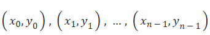

# 🔥 GIZI ANTI RIBET: Kalkulator AKG Lagrange

Halo gaes! Selamat datang di project keren ini.

Ini adalah aplikasi web *Streamlit* yang kita bikin pakai *Python. Fungsinya? Biar kalian bisa hitung **Angka Kecukupan Gizi (AKG)* dengan hasil yang super duper akurat karena kita pakai skill matematika tingkat tinggi: *Metode Lagrange!*

Intinya: Gak perlu pusing sama perhitungan manual lagi!

---

## 🤩 LANGSUNG COBAIN AJA!
## 🖼 Tampilan Aplikasi

Udah siap pakai dan live! Buktiin sendiri deh akurasinya:

👉 **[GAS, KLIK DI SINI BUAT COBA KALKULATOR LAGRANGE!](https://bit.ly/3KILFZb)** 👈

---

## ⚙️ The Engine Room: Teknologi & Metode (Materi Inti)

Proyek ini tidak hanya sekadar kalkulator, tetapi sebuah implementasi canggih dari ilmu data dan matematika terapan untuk gizi.

* **💻 Bahasa Pemrograman:** Python
* **🌐 Kerangka Kerja Web:** [Streamlit](https://streamlit.io/) (Membuat *data app* interaktif dan mudah diakses)

### 🧠 Otak di Balik Akurasi: Metode Interpolasi Lagrange

Kami menggunakan **Interpolasi Lagrange** karena standar AKG seringkali hanya tersedia untuk kelompok usia/berat badan tertentu (titik data diskrit). Metode ini memungkinkan kami mengestimasi nilai AKG (*y*) yang presisi untuk setiap input usia/berat badan (*x*) yang berada di antara titik data standar tersebut.

## ⚙️ The Engine Room: Teknologi & Metode (Materi Inti)

Proyek ini tidak hanya sekadar kalkulator, tetapi sebuah implementasi canggih dari ilmu data dan matematika terapan untuk gizi.

* **💻 Bahasa Pemrograman:** Python
* **🌐 Kerangka Kerja Web:** [Streamlit](https://streamlit.io/) (Membuat *data app* interaktif dan mudah diakses)

### 🧠 Otak di Balik Akurasi: Metode Interpolasi Lagrange

Kami menggunakan **Interpolasi Lagrange** karena standar AKG seringkali hanya tersedia untuk kelompok usia/berat badan tertentu (titik data diskrit). Metode ini memungkinkan kami mengestimasi nilai AKG (*y*) yang presisi untuk setiap input usia/berat badan (*x*) yang berada di antara titik data standar tersebut.

#### Konsep Matematis

Misalkan kita memiliki n titik data AKG yang sudah terstandarisasi:

 

Polinomial Lagrange P(x) didefinisikan sebagai:

dengan **** adalah basis polinomial Lagrange yang didefinisikan sebagai:

#### Penerapan pada Gizi

1.  **Input:** Pengguna memasukkan usia, berat, dan jenis kelamin ($x$).
2.  **Titik Data ****:** Kami menggunakan data AKG standar dari Kemenkes/FAO/WHO yang tersedia untuk kelompok usia/berat badan tertentu.
3.  **Output:** Aplikasi menghitung $P(x)$ untuk mendapatkan estimasi AKG (*y*) yang sangat personal dan spesifik untuk input pengguna tersebut, bukan hanya pembulatan ke kategori terdekat.

---
---

## 🤝 Kontributor & Tim Tempur (Profil)

Proyek keren ini terwujud berkat kolaborasi tim yang bersemangat. Kami terbuka untuk kontribusi!

| Nama | GitHub |
| **[Fauziah Rahma]** | [@fauziah1011](https://github.com/fauziah1011) |
| **[Aliffia Hilva]** | [@FIADANRARA](https://github.com/FIADANRARA) |

---

## 📄 Lisensi & Status

* **Status Proyek:** Aktif 
* **Versi Saat Ini:** v1.0.0
