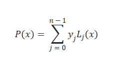
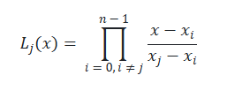

# 🚀 GIZI ANTI RIBET: Kalkulator AKG Lagrange

## 🎉 Selamat Datang di NutriMatch!

Halo teman-teman pelajar dan pegiat hidup sehat!

Selamat datang di **GIZI ANTI RIBET**, sebuah proyek keren yang membuat perhitungan Angka Kecukupan Gizi (AKG) jadi super mudah dan sangat akurat.

Tujuan kami sederhana: **Memberikan estimasi kebutuhan gizi harian yang presisi, bukan hanya perkiraan kasar.**

### 🖼 Tampilan Aplikasi

👉 **[LANGSUNG COBAIN KALKULATOR AKG LAGRANGE DI SINI!](https://bit.ly/3KILFZb)** 👈

---

## ✨ Kenapa Kalkulator Ini Spesial?

Kalkulator Gizi biasa seringkali hanya membulatkan kebutuhan Anda ke kategori usia atau berat badan terdekat. Kami tidak! Kami menggunakan ilmu pasti, yaitu **Metode Numerik Interpolasi Lagrange**, untuk memberikan estimasi yang benar-benar personal.

### 🧠 Otak di Balik Akurasi: Interpolasi Lagrange

Kami membangun sebuah model matematika untuk mengisi celah antara data AKG standar (titik-titik rujukan).

| Fitur | Manfaat untuk Anda |
| :--- | :--- |
| **Interpolasi Lagrange** | Menghasilkan kurva yang melewati *semua* titik data AKG rujukan. |
| **Estimasi Presisi** | Jika Berat Badan (BB) Anda 67,5 kg, kami tidak membulatkannya ke 60 kg atau 70 kg. Kami hitung AKG yang persis untuk 67,5 kg. |
| **Personalisasi** | Hasil yang Anda dapatkan adalah AKG (x) yang spesifik, di mana x adalah Berat Badan Anda. |

#### Konsep Inti:

Metode ini menggunakan Polinomial Lagrange P(x) untuk menentukan nilai gizi y berdasarkan Berat Badan x Anda.

**1. Rumus Polinomial Lagrange:**

**2. Rumus Basis Polinomial:**

---

## 💻 Detail Proyek (The Engine Room)

Proyek ini adalah implementasi dari pembelajaran mata kuliah Metode Numerik yang disajikan dalam bentuk aplikasi web yang siap pakai.

* **Bahasa:** Python
* **Kerangka Kerja Web:** [Streamlit](https://streamlit.io/) (Membuat aplikasi data interaktif menjadi sangat cepat).

## 🛠️ Tim Kontributor

| Nama | NIM |
| :--- | :--- |
| **Aliffia Hilva Salsabila** | K1323006 |
| **Fauziah Rahmawati Sholehah** |K1323026 |

---

## 📜 Lisensi & Status

Proyek ini **Aktif** dan dikembangkan untuk tujuan edukasi dan kesehatan masyarakat.
* **Versi Saat Ini:** v1.0.0 (Stabil)
